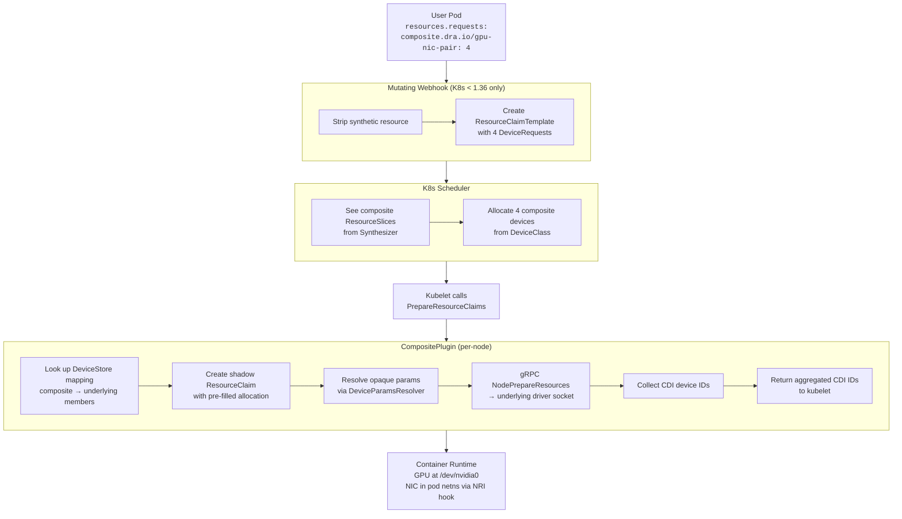
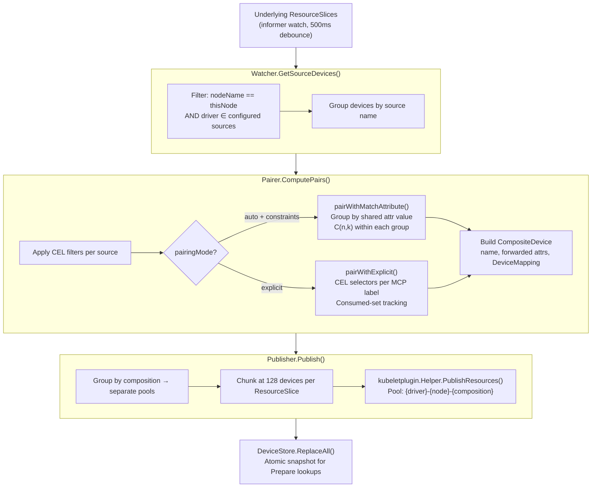
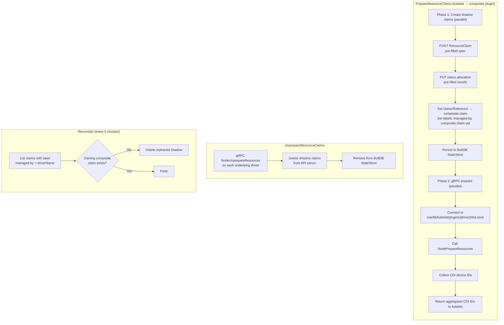
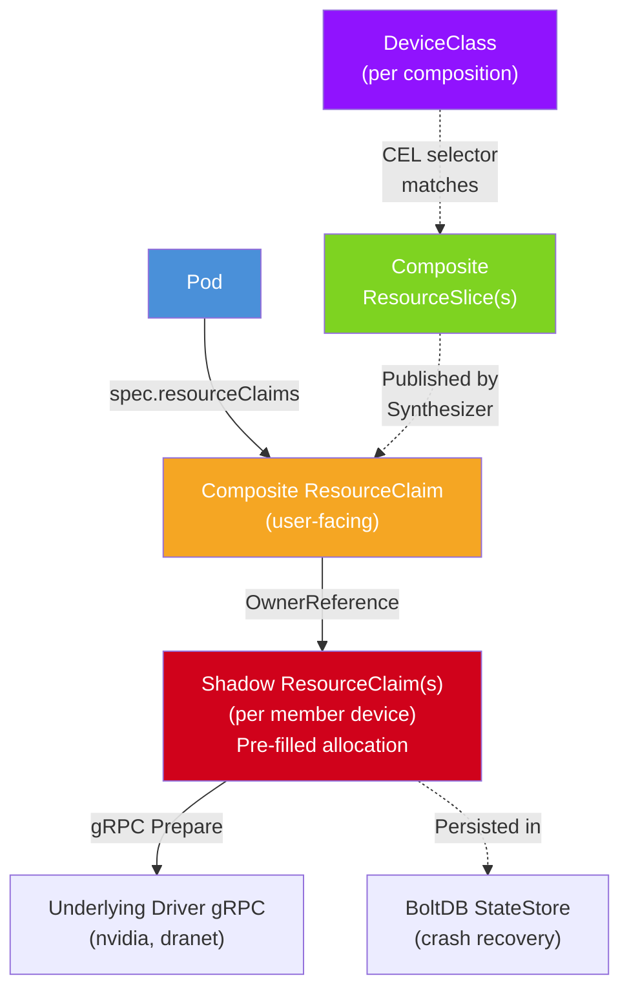

# Composite DRA Driver — Architecture & Expressiveness Reference

**RFC Companion Document**

---

## 0. Executive Summary

The composite DRA driver presents cross-driver device groupings (e.g., GPU + RDMA NIC matched by PCIe topology) to the Kubernetes scheduler as first-class allocatable resources via ResourceSlices. It replaces the prior approach of bypassing the scheduler entirely. The driver is generic and config-driven — adding a new underlying driver is a YAML change, not a code change.

This document addresses three review concerns alongside the architectural overview:

| Concern | Section | Summary |
|---------|---------|---------|
| Are we expressive enough? | [§2 Expressiveness](#2-expressiveness-what-we-can-express) | Three pairing strategies, CEL filters, attribute forwarding, opaque device params via Go templates, multiple simultaneous compositions |
| What can't we express yet? | [§3 Gaps](#3-gaps-what-we-cannot-express-yet) | Consumable capacity (grouped mode), best-effort NUMA, cross-composition device exclusion, VF support |
| Are we violating unwritten rules? | [§4 Compliance](#4-dra-ecosystem-compliance) | Shadow claims not in pod.spec (validated safe), pre-filled allocation (medium risk), virtual ResourceSlices (medium risk) |

---

## 1. System Overview

### 1.1 Problem

The DRA scheduler cannot natively allocate cross-driver device groupings. A GPU and a RDMA NIC on the same PCIe root are managed by separate drivers (`gpu.nvidia.com`, `dra.net`) with no linkage between their ResourceSlices. The previous approach (dra-rail-admission-webhook) solved this by scanning ResourceSlices, picking devices, and pinning pods to nodes — bypassing the scheduler. This driver returns scheduling authority to the K8s scheduler.

### 1.2 Two Binaries

| Binary | Deployment | Role | Required |
|--------|-----------|------|----------|
| `composite-dra-driver` | DaemonSet (one per node) | Watch underlying ResourceSlices, pair devices, publish composite ResourceSlices, handle Prepare/Unprepare via shadow claims | Always |
| `composite-dra-webhook` | Deployment (single replica) | Intercept synthetic resource requests, generate ResourceClaimTemplates | K8s < 1.36 only |

On K8s 1.36+, the `DRAExtendedResource` feature gate (beta) allows users to request composite devices via standard `resources.requests` — no webhook needed.

### 1.3 End-to-End Allocation Flow



### 1.4 Synthesizer Pipeline

The synthesizer runs on every node as a continuous pipeline:



---

## 2. Expressiveness: What We Can Express

### 2.1 Pairing Strategies

| Strategy | Config | Algorithm | Use Case |
|----------|--------|-----------|----------|
| Auto + matchAttribute | `constraints: [{type: matchAttribute, attribute: "resource.kubernetes.io/pcieRoot"}]` | Group devices by shared attribute value. Generate C(n,k) combinations within each group. Group must have all member sources at required counts. | GPU+NIC by PCIe root, NUMA-locality pairing |
| Explicit (CEL per MCP) | `pairingMode: explicit`, `nodePoolLabelKey`, `nodePools[].pairs[].selectors` | Match node by label → evaluate per-source CEL selectors → select first N matching devices → consumed-set tracking prevents reuse. Rail and NUMA are set explicitly per pair. | Heterogeneous hardware (e.g., AKS VMs where pcieRoot isn't exposed), known-good pairings |

Implementation: `pkg/synthesizer/pairer.go`. The `computeForComposition()` method routes to the appropriate strategy based on `PairingMode` and presence of constraints.

### 2.2 Source Filtering (CEL)

Each source in a composition can have a CEL filter that runs before pairing to reduce the candidate set:

```yaml
compositions:
- name: gpu-nic-pair
  filters:
    nvidia:
      cel: "device.attributes['nvidia.com/memory'] > 40000"
    dra-net:
      cel: "device.attributes['dra.net/rdma'] == true"
```

CEL programs are compiled once and cached (`pkg/synthesizer/cel.go`). The filter variable is a map-of-maps: `device.attributes[domain][attribute]`. Filters reduce combinatorial explosion before the pairer generates combinations.

### 2.3 Attribute Forwarding

Sources declare which attributes to forward into the composite device:

```yaml
sources:
- name: nvidia
  forwardAttributes:
  - domain: nvidia.com
    attributes: [model, memory]
  - domain: ""
    attributes: [pcie_slot]
```

In the composite ResourceSlice, attributes are prefixed by source name: `nvidia/model`, `nvidia/memory`, `nvidia/pcie_slot`. When a composition has a `matchAttribute` constraint, the constraint attribute is also emitted under its original key. Synthetic attributes are injected automatically: `composite/compositionName`, `composite/numaNode`.

### 2.4 Opaque Device Params (Go Templates)

The `DeviceParamsResolver` (`pkg/shadow/params.go`) resolves per-device opaque parameters from an external ConfigMap. This is how driver-specific configuration (e.g., RDMA routing tables, gateway addresses) flows through to shadow claims without the composite driver interpreting it.

Resolution chain:

1. Match device attributes against entries (prefix/exact matchers on attribute values)
2. Apply per-node overrides (nodeSelector on node labels)
3. Execute Go template with merged values + built-in functions
4. Inject as `OpaqueDeviceConfiguration` in shadow claim's allocation config

Template variables include `{{.PairOrdinal}}`, `{{.NodeName}}`, `{{.SourceName}}`, `{{device "dra.net/ipv4"}}`, plus all matched entry values.

Example (B200 PF mode):
```yaml
dra-net:
  entries:
  - match:
      "dra.net/ipv4": {prefix: "10.0."}
    values:
      Gateway: "10.0.0.1"
      CIDR: "10.0.0.0/16"
  params: |
    {"gateway": "{{.Gateway}}", "network": "{{network .CIDR}}"}
```

### 2.5 Multiple Simultaneous Compositions

The config supports N compositions, each with its own members, constraints, filters, and DeviceClass. The publisher groups devices by composition name into separate ResourceSlice pools. Example: `gpu-nic-pair` and `gpu-only` compositions coexist on the same node.

Each composition produces a DeviceClass with a CEL selector:
```
device.driver == "<driverName>" && device.attributes["composite"].compositionName == "<name>"
```

### 2.6 N-ary Compositions

Compositions are not limited to pairs. A 3-member composition (GPU + NIC + NVSwitch) works identically — the pairer generates C(n,k) combinations across all member sources, and shadow claims are created for each member.

### 2.7 Expressiveness Summary

| Use Case | Supported | Mechanism |
|----------|-----------|-----------|
| GPU+NIC by PCIe root | Yes | matchAttribute on pcieRoot |
| GPU+NIC+NVSwitch 3-way | Yes | 3-member composition |
| RDMA-only NICs (filter non-RDMA) | Yes | CEL filter `rdma == true` |
| Per-rail routing config | Yes | DeviceParamsResolver templates |
| Per-node gateway overrides | Yes | nodeSelector overrides in params |
| NUMA-constrained pairs | Partial | matchAttribute on numaNode (hard constraint only) |
| Multiple composition types simultaneously | Yes | Independent compositions + DeviceClasses |
| Custom DeviceClass per composition | Yes | `deviceClassName` override field |
| Heterogeneous node topologies | Yes | Explicit pairing mode per MCP label |
| Custom extended resource name | Yes | `extendedResourceName` override (K8s 1.36+) |
| Include/exclude specific devices | Partial | CEL filters (include-only, no exclude syntax) |

---

## 3. Gaps: What We Cannot Express Yet

### 3.1 Gap Summary

| Gap | Issue | Severity | Root Cause | Path Forward |
|-----|-------|----------|-----------|--------------|
| Consumable capacity | [#21](https://github.com/openshift-psap/composite-dra-driver/issues/21) | **High** | Discrete device model vs grouped mode + AllowMultipleAllocations | Investigation in progress |
| NUMA affinity enforcement | [#1](https://github.com/openshift-psap/composite-dra-driver/issues/1) | Medium | matchAttribute is hard constraint, no best-effort | Per-NUMA DeviceClasses or scheduler plugin |
| Cross-composition device exclusion | [#28](https://github.com/openshift-psap/composite-dra-driver/issues/28) | Medium | DRA has no cross-pool mutual exclusion | Pairer-side partitioning or continuous synthesizer recomputation ([upstream discussion](https://github.com/kubernetes-sigs/wg-device-management/issues/54)) |
| VF support + external IPAM | [#34](https://github.com/openshift-psap/composite-dra-driver/issues/34) | Medium | VFs lack IP attributes at pairing time, need external IPAM | External IPAM controller integration |
| Blast radius isolation | [#35](https://github.com/openshift-psap/composite-dra-driver/issues/35) | Medium | Single ConfigMap = single point of failure | Per-composition ConfigMaps or partial startup |
| Observability | [#18](https://github.com/openshift-psap/composite-dra-driver/issues/18) | Medium | No metrics, no K8s events, no structured logging | Prometheus + K8s events |
| Combined shadow claims | [#7](https://github.com/openshift-psap/composite-dra-driver/issues/7) | Low | kubeletplugin.Helper multi-driver claim handling unverified | Upstream investigation |
| Attribute deduplication | [#4](https://github.com/openshift-psap/composite-dra-driver/issues/4) | Low | Redundant attributes across sources (32-attr limit matters) | Dedup rules in buildCompositeDevice |
| Node-property templating | — | Low | Go templates only see device attrs + static values | Add node label injection to template context |

### 3.2 Deep Dive: Consumable Capacity

**This is the most significant expressiveness gap.**

The composite driver's model is: 1 composite device = 1 allocatable unit. The pairer generates discrete `CompositeDevice` structs, each with a `Name` and `Attributes` but no capacity. Shadow claims request `Count: 1` for each member.

CPU and memory DRA drivers use a different model: **grouped mode**. A single device represents a pool of resources with a `Capacity` field (e.g., `dra.cpu/cpu: 64`) and `AllowMultipleAllocations: true`. Multiple claims can allocate from the same device by consuming portions of its capacity.

What breaks:
- The publisher (`pkg/synthesizer/publisher.go`) builds `resourceapi.Device{Name, Attributes}` with no `Capacity` field
- Shadow claims set `Count: 1` — cannot express "allocate 8 CPUs from this NUMA group"
- The pairer's combinatorial model assumes exclusive, discrete devices — it generates C(n,k) combinations, not capacity reservations
- `AllowMultipleAllocations` is not set on composite devices

The investigation at `docs/investigations/cpu-memory-compat.md` has analyzed CPU and memory driver interfaces (attributes, CDI output, NRI hooks) but grouped-mode handling, shadow claim capacity flow, and AllowMultipleAllocations interaction are all still pending.

**Impact:** Compositions involving CPU or memory resources (CPU+GPU+NIC for full NUMA-pinned allocation) cannot be expressed. This affects the long-term goal of holistic NUMA-aware resource composition.

### 3.3 Deep Dive: NUMA Affinity

The `matchAttribute` constraint on `numaNode` is a hard requirement, not best-effort. If a user requests 4 GPU-NIC pairs on the same NUMA zone and only 3 exist on one zone (but 4 exist across two zones), the pod stays Pending forever.

The prior webhook avoided this by scanning ResourceSlices and falling back to cross-NUMA allocation. The composite driver delegates scheduling entirely — it cannot scan ResourceSlices to make allocation decisions.

Mitigations considered:
- **Per-NUMA DeviceClasses** ([#1](https://github.com/openshift-psap/composite-dra-driver/issues/1)): Create `composite-gpu-nic-numa0`, `composite-gpu-nic-numa1` with corresponding extended resource names. Users request per-NUMA explicitly. Proliferates DeviceClass objects but requires no scheduler changes.
- **Custom scheduler plugin**: Implement `topologymanager.HintProvider`-style best-effort NUMA packing. Requires upstream KEP.

Current state: NUMA is opt-in only. The webhook removed automatic NUMA constraints (commit 624fbee, Discussion #11).

### 3.4 Deep Dive: Cross-Composition Device Exclusion

When the same source (e.g., GPU) participates in multiple compositions (`gpu-nic-pair` and `gpu-only`), the pairer publishes the same physical GPU in two different ResourceSlice pools. The DRA scheduler has no cross-pool mutual exclusion — it can allocate the same physical GPU from both pools simultaneously.

The underlying driver (nvidia) rejects the second `PrepareResourceClaims` call with `requested device gpu-0 is already allocated to different claim`, causing the second pod to fail.

Current safety: works only when one composition type is used per cluster, or workloads are spread across nodes.

Two proposed approaches ([#28](https://github.com/openshift-psap/composite-dra-driver/issues/28), [upstream discussion](https://github.com/kubernetes-sigs/wg-device-management/issues/54)):

- **Pairer-side partitioning** — statically assign each physical device to at most one composition's pool. Options: priority-based (higher-priority compositions pick first), ratio-based (admin specifies device quota), or exclusive-source (disjoint source references). No race window, but wastes devices that could serve either pool.
- **Continuous synthesizer recomputation** — the synthesizer already re-watches underlying ResourceSlices on change. Extend it to detect when a member device is allocated by another pool and remove the corresponding composite devices from published ResourceSlices. Full device utilization, but a small race window exists between allocation and recomputation where the scheduler could still pick a stale composite device (Prepare would fail, scheduler reschedules).

Neither is implemented yet.

---

## 4. DRA Ecosystem Compliance

### 4.1 Risk Matrix

| Practice | Convention | Our Behavior | Risk | Evidence |
|----------|-----------|-------------|------|----------|
| Shadow claims not in pod.spec | Unwritten: claims assumed to be in pod.spec | Create real claims with OwnerRef to composite claim | **Low** | Neither nvidia nor dranet checks pod.spec. kubeletplugin.Helper checks only: exists, allocated, UID match. Validated in [STATUS.md](STATUS.md). |
| Pre-filled allocation status | Allocation normally set by scheduler | We set `status.allocation` ourselves via UpdateStatus | **Medium** | Works because Helper trusts any allocated claim. Risk: future K8s validation could check allocation provenance. |
| Virtual ResourceSlices | Drivers publish slices for devices they manage | We publish slices for devices other drivers manage | **Medium** | Scheduler treats ResourceSlices at face value. No provenance validation exists. Risk: future "resource provenance" checks. |
| Kubelet plugin with no hardware | DRA plugins own hardware | Pure orchestrator, delegates everything | **Medium** | Novel pattern. kubelet treats all DRA plugins identically — calls PrepareResourceClaims, expects CDI IDs. No validation that the plugin "owns" hardware. |
| OwnerRef GC chain | Single-level ownership typical | Pod → composite claim → shadow claims (2-level) | **Low** | K8s GC handles multi-level chains. Reconciler handles orphans from race conditions. |
| Webhook mutation ordering | Mutating webhooks unordered | Modifies pod.spec.resourceClaims, removes synthetic resources | **Low** | `composite.dra/mutated` annotation prevents re-processing. Only conflicts if another webhook acts on the same synthetic resource names. |
| Shadow claim name hashing | K8s names must be deterministic and collision-free | `shadow-<8 hex chars>-<source>-<device>` (SHA256 truncated to 4 bytes) | **Very Low** | 4.3 billion possibilities per composite claim. Collision requires same composite claim name AND same source/device. |

### 4.2 Shadow Claim Lifecycle

The shadow claim mechanism is the core of the architecture and the area most likely to draw scrutiny.

**What we do:** When kubelet calls `PrepareResourceClaims` for a composite device, we create real `ResourceClaim` objects in the API server with pre-filled allocation status, then call each underlying driver's gRPC socket with these shadow claims.

**What the underlying drivers see:** A normally-allocated ResourceClaim. The kubeletplugin.Helper performs exactly three checks before passing the claim to the driver:

1. Claim exists in API server — **satisfied** (we create it)
2. `claim.Status.Allocation != nil` — **satisfied** (we set it via UpdateStatus)
3. `claim.UID == request.UID` — **satisfied** (we pass the created claim's UID)

**What is NOT checked:** ReservedFor validity, presence in any pod.spec, who set the allocation, whether the scheduler made the allocation decision. This has been validated against nvidia GPU driver, dranet, and the kubeletplugin.Helper library — see `docs/STATUS.md` for the full codepath trace.

**Kubelet cleanup asymmetry:** Kubelet only calls `UnprepareResourceClaims` for claims listed in `pod.spec.resourceClaims`. Shadow claims are NOT in pod.spec. Therefore:
- On composite Unprepare: the composite driver calls underlying drivers' `NodeUnprepareResources` for each shadow, then deletes the shadow claims
- BoltDB StateStore persists shadow records for crash recovery
- OwnerReferences (shadow → composite claim) provide GC fallback
- Reconciler (5-minute interval) catches orphaned shadows where the composite claim was deleted



### 4.3 K8s Object Relationships



---

## 5. Component Reference

### 5.1 Package Map

| Package | Key Types | Responsibility |
|---------|-----------|---------------|
| `cmd/driver` | `main()` | DaemonSet entry point. Wires synthesizer + plugin. |
| `cmd/webhook` | `main()` | Webhook HTTP server with TLS. Starts template reconciler goroutine. |
| `pkg/config` | `CompositeConfig`, `CompositionConfig`, `ExplicitPairConfig` | Config parsing, validation. Blocks multi-level composition (driver name ∉ sources). |
| `pkg/synthesizer` | `Synthesizer`, `Watcher`, `Pairer`, `CELFilter`, `Publisher` | Watch source ResourceSlices, compute pairings, publish composite slices. |
| `pkg/plugin` | `CompositePlugin`, `GRPCClient`, `Reconciler` | DRAPlugin implementation. Shadow claim orchestration, gRPC delegation, orphan cleanup. |
| `pkg/shadow` | `ClaimManager`, `DeviceParamsResolver` | Shadow claim CRUD. Opaque params resolution via Go templates. |
| `pkg/store` | `DeviceStore`, `StateStore` | In-memory composite→underlying mapping (RWMutex). BoltDB crash recovery. |
| `pkg/webhook` | `Mutator`, `Handler`, `ClaimBuilder`, `TemplateReconciler` | Admission webhook. Pod mutation, claim template generation, template GC. |

### 5.2 Important Constants

| Constant | Value | Location |
|----------|-------|----------|
| Max devices per ResourceSlice | 128 | `pkg/synthesizer/publisher.go` |
| Watcher debounce interval | 500ms | `pkg/synthesizer/watcher.go` |
| K8s name max length | 63 chars | `pkg/synthesizer/pairer.go`, `pkg/shadow/claims.go` |
| Shadow claim hash prefix | 8 hex chars (4 bytes SHA256) | `pkg/shadow/claims.go` |
| Plugin reconcile interval | 5 minutes | `pkg/plugin/reconciler.go` |
| Webhook reconcile interval | 5 minutes (configurable via `--reconcile-interval`) | `cmd/webhook/main.go` |
| Webhook reconcile grace period | 2 minutes (configurable via `--reconcile-grace-period`) | `cmd/webhook/main.go` |
| Default plugin dir | `/var/lib/kubelet/plugins` | `cmd/driver/main.go` |
| Default state dir | `/var/lib/composite-dra` | `cmd/driver/main.go` |
| Default config path | `/etc/composite-dra/config.yaml` | `cmd/driver/main.go` |

### 5.3 Configuration Schema

```yaml
driver:
  name: "composite.dra.io"              # Composite driver name (registered with kubelet)

sources:
- name: nvidia                          # Unique source identifier (used in compositions)
  driver: gpu.nvidia.com                # Underlying DRA driver name
  deviceClassName: gpu.nvidia.com       # DeviceClass for shadow claims
  forwardAttributes:                    # Attributes to forward into composite devices
  - domain: nvidia.com
    attributes: [model, memory]
  socketPath: ""                        # Override gRPC socket (default: {pluginDir}/{driver}/dra.sock)

- name: dra-net
  driver: dra.net
  deviceClassName: dra-rdma-nic
  forwardAttributes:
  - domain: dra.net
    attributes: [speed, mtu, rdma_type, ipv4]
  - domain: resource.kubernetes.io
    attributes: [pcieRoot]

compositions:
- name: gpu-nic-pair                    # Composition name (→ pool name, DeviceClass)
  members:
  - source: nvidia                      # Reference to source[].name
    count: 1                            # Devices per member per composite device
  constraints:
  - type: matchAttribute                # Only supported type
    attribute: "resource.kubernetes.io/pcieRoot"
  filters:                              # Optional CEL pre-filters per source
    nvidia: {cel: "..."}
  pairingMode: auto                     # "auto" (default) or "explicit"
  deviceClassName: ""                   # Override (default: "composite-{name}")
  extendedResourceName: ""              # Override (default: "{driverName}/{name}")
  # Explicit mode only:
  nodePoolLabelKey: "machine.openshift.io/pool"
  nodePools:
  - label: gpu-nodes
    pairs:
    - selectors:
        nvidia: "device.attributes['nvidia.com/model'] == 'H100'"
        dra-net: "device.attributes['dra.net/speed'] == '100Gbps'"
      rail: 0
      numa: 0

deviceParams:                           # Optional: external opaque params for shadow claims
  configMapPath: /etc/composite-dra/device-params/params.yaml
```

**Validation rules** (`pkg/config/validation.go`):
- (Composite) Driver name must NOT appear in sources (blocks multi-level composition)
- Source names must be unique
- Composition names must be unique
- All member sources must exist in sources list
- Member count ≥ 1
- Constraints type must be "matchAttribute"
- Explicit mode requires nodePoolLabelKey, ≥1 nodePool with ≥1 pair, selectors for all member sources, non-empty CEL expressions
- Explicit mode cannot coexist with constraints

---

## 6. Deployment & Operations

### 6.1 Topology

- **Driver DaemonSet**: All nodes including control-plane. Priority `system-node-critical`. Tolerates `node-role.kubernetes.io/control-plane`, `not-ready`, `unreachable`. Rolling update with `maxUnavailable: 1`. Privileged container with hostPath mounts for kubelet plugins, kubelet registry, and BoltDB state.
- **Webhook Deployment**: Single replica. Behind a Service (port 443 → 8443). TLS via cert-manager. Readiness probe on `/healthz`. Only deploys on K8s < 1.36 when `webhook.mode: auto`.
- **Namespace**: `composite-dra-system`
- **OpenShift**: SCC manifest grants privileged access to the driver ServiceAccount.
- **Helm chart**: `charts/composite-dra-driver/` with values files for different clusters.

### 6.2 Crash Recovery

On driver pod restart:
1. BoltDB `StateStore.ListAll()` loads persisted shadow claim records
2. In-memory `shadowClaims` map is rebuilt
3. Shadow claims still exist in etcd (kubelet hasn't deleted them — they're not in pod.spec)
4. Next `UnprepareResourceClaims` call for any surviving composite claims cleans up properly
5. Orphan reconciler (5-min loop) catches stale shadows where the composite claim was deleted during downtime

### 6.3 Failure Scenarios

| Scenario | Effect | Recovery |
|----------|--------|----------|
| Driver pod crash mid-Prepare | Shadow claims partially created | OwnerRef GC deletes orphans. Reconciler catches stragglers. kubelet retries Prepare. |
| Underlying driver unavailable | gRPC prepare fails | CompositePlugin returns error to kubelet. Pod stays in ContainerCreating. kubelet retries. |
| API server unavailable | Shadow claim creation fails | CompositePlugin returns error. kubelet retries when API server recovers. |
| Stale composite ResourceSlice | Scheduler allocates device that no longer exists on node | Prepare fails (DeviceStore lookup miss). Scheduler reschedules. Self-healing. |
| Webhook pod crash | Pod creation not mutated (if both replicas down) | failurePolicy: Fail → pod creation rejected. User retries when webhook recovers. |

### 6.4 Performance

Measured for 8 GPU-NIC pairs (16 shadow claims):

| Phase | Duration | Notes |
|-------|----------|-------|
| Shadow claim creation | 15ms | Parallel + QPS=100 (was 3.0s at default QPS=5) |
| gRPC prepare (nvidia + dranet) | ~3s | nvidia CDI spec gen serialized internally (~250ms/GPU). This is the floor. |
| Total Prepare | ~3s | Shadow creation is negligible. nvidia is the bottleneck. |

---

## 7. Open Questions for RFC Reviewers

### Q1: Is the shadow claim pattern sustainable?

No upstream DRA driver currently validates that ResourceClaims appear in `pod.spec.resourceClaims`. No K8s component checks who set `status.allocation`. This is validated today, but it is an implicit dependency on implementation details, not API contracts. Should we propose formalizing a "delegating driver" pattern upstream (e.g., a KEP), or treat shadow claims as a private implementation detail?

### Q2: Should consumable capacity block v1?

The discrete-device model cannot express CPU/memory grouped-mode resources with `AllowMultipleAllocations` and `Capacity` fields. This limits compositions to GPU+NIC-style discrete hardware. Is this acceptable for an initial release, or does the vision of full NUMA-pinned composition (GPU+NIC+CPU+Memory) require capacity support from day one?

### Q3: Cross-composition device exclusion — where should it be solved?

Two driver-level approaches are proposed: static pairer-side partitioning (wastes devices, no race) or continuous synthesizer recomputation (full utilization, small race window). The root problem is that DRA has no cross-pool mutual exclusion primitive. Is this a gap the DRA API should fill (benefiting the ecosystem), or is the driver layer the right place? [Upstream discussion](https://github.com/kubernetes-sigs/wg-device-management/issues/54).

### Q4: Virtual ResourceSlice publishing — precedent or anti-pattern?

The composite driver publishes ResourceSlices for devices it does not physically manage. The scheduler treats these at face value. This is a novel pattern — no other upstream driver does this. Is this a valid extension of the DRA model, or should there be a formal concept of "virtual" or "derived" resource slices?

---

## Appendix A: Measured Prepare Timing

| Phase | Operation | Duration | Notes |
|-------|-----------|----------|-------|
| **Phase 1** | 16× POST ResourceClaim | 12ms | Parallel, QPS=100 |
| | 16× PUT status.allocation | 3ms | Parallel |
| | **Phase 1 total** | **15ms** | |
| **Phase 2** | nvidia NodePrepareResources (8 claims) | 2.8s | Serialized CDI gen (~250ms/GPU) |
| | dranet NodePrepareResources (8 claims) | 160ms | Parallel with nvidia |
| | **Phase 2 total** | **2.96s** | nvidia is the long pole |
| | **Wall clock** | **2.98s** | Shadow creation is negligible |

## Appendix B: Shadow Claim Example

```yaml
apiVersion: resource.k8s.io/v1
kind: ResourceClaim
metadata:
  name: shadow-a1b2c3d4-nvidia-gpu0
  namespace: default
  labels:
    app.kubernetes.io/managed-by: composite.dra.io
    composite-claim-uid: "01234567-89ab-cdef"
  ownerReferences:
  - apiVersion: resource.k8s.io/v1
    kind: ResourceClaim
    name: user-pods-gpus
    uid: "01234567-89ab-cdef"
spec:
  devices:
    requests:
    - name: member-0
      exactly:
        deviceClassName: gpu.nvidia.com
        allocationMode: ExactCount
        count: 1
status:
  allocation:
    devices:
      results:
      - request: member-0
        driver: gpu.nvidia.com
        pool: nvidia-pool-0
        device: gpu0
      config:
      - source: Claim
        requests: [member-0]
        deviceConfiguration:
          opaque:
            driver: gpu.nvidia.com
            parameters: <resolved JSON from DeviceParamsResolver>
  reservedFor:
  - podUID: "fedcba98-7654-3210"
```

## Appendix C: Example Config (GPU-NIC Pair + GPU-Only)

```yaml
driver:
  name: composite.dra.io

sources:
- name: nvidia
  driver: gpu.nvidia.com
  deviceClassName: gpu.nvidia.com
  forwardAttributes:
  - domain: nvidia.com
    attributes: [model, memory, compute_capability]
  - domain: resource.kubernetes.io
    attributes: [pcieRoot]

- name: dra-net
  driver: dra.net
  deviceClassName: dra-rdma-nic
  forwardAttributes:
  - domain: dra.net
    attributes: [speed, mtu, rdma_type, ipv4]
  - domain: resource.kubernetes.io
    attributes: [pcieRoot]

compositions:
- name: gpu-nic-pair
  members:
  - source: nvidia
    count: 1
  - source: dra-net
    count: 1
  constraints:
  - type: matchAttribute
    attribute: "resource.kubernetes.io/pcieRoot"
  filters:
    dra-net:
      cel: "device.attributes['dra.net/rdma_type'] == 'RoCE'"

- name: gpu
  members:
  - source: nvidia
    count: 1

deviceParams:
  configMapPath: /etc/composite-dra/device-params/params.yaml
```
