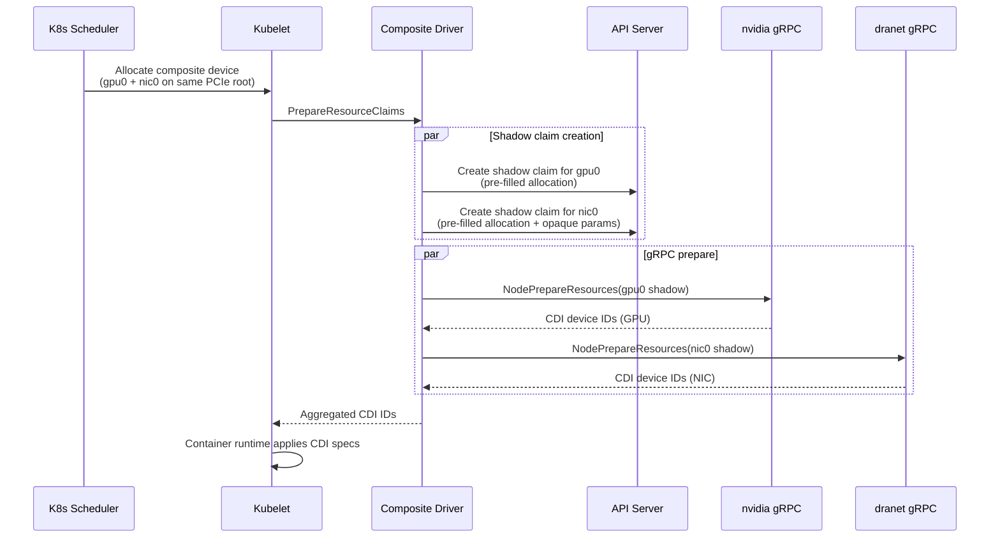

# RFC: Composite Dynamic Resource Allocation Driver

**Status:** Draft
**Authors:** Thameem Abbas
**Date:** 2026-06-18

---

## 1. Motivation

GPU-accelerated inference workloads (e.g., llm-d) require co-located GPU + RDMA NIC pairs — devices on the same PCIe root complex for optimal data path locality. Today these devices are managed by independent DRA drivers (`gpu.nvidia.com`, `dra.net`) that publish separate ResourceSlices with no cross-driver linkage.

### The gap

The Kubernetes scheduler cannot express "allocate a GPU and a NIC that share a PCIe root" as a single atomic operation. Each driver publishes its own ResourceSlices independently. There is no DRA primitive for cross-driver device composition — no way to tell the scheduler that two devices from different drivers must be co-located by topology.

This means:
- **No topology-aware cross-driver allocation.** The scheduler can allocate a GPU and a NIC on the same node, but cannot guarantee they share a PCIe root, NUMA node, or any other topology relationship.
- **No atomic cross-driver grouping.** Allocating a GPU from one driver and a NIC from another are two independent scheduling decisions. If the NIC allocation fails, the GPU allocation is not rolled back.
- **No composition as a scheduling unit.** Users cannot request "4 GPU-NIC pairs" as a single resource quantity. Each device type must be requested separately.

### What we propose

A composite DRA driver that presents cross-driver device groupings to the scheduler as first-class allocatable resources. The scheduler allocates natively — composition is a scheduling unit, topology constraints are enforced at pairing time, and allocation is atomic.

---

## 2. Proposal: Shadow Claims Pattern

The composite driver publishes ResourceSlices where each device represents a pre-validated grouping of underlying devices (e.g., a GPU-NIC pair on the same PCIe root). The scheduler sees these as normal devices and allocates them through standard DRA machinery.

The core mechanism is **shadow claims**: when kubelet calls `PrepareResourceClaims` for a composite device, the driver creates real ResourceClaims in the API server for each underlying driver — with pre-filled allocation pointing to the specific underlying devices — then calls each driver's gRPC socket directly.



### Why shadow claims

The composite driver is a **pure orchestrator** — it contains zero nvidia or dranet code. Shadow claims delegate all device preparation to the real drivers via their existing gRPC interfaces. This means:

- **No reimplementation.** Driver internals (CDI spec generation, NRI hooks, device health) stay in the drivers that own them. Upstream driver changes don't break the composite driver.
- **Config-driven extensibility.** Adding a new underlying driver is a YAML config change — source name, driver name, DeviceClass, attribute forwarding rules. No code changes.
- **Validated compatibility.** Shadow claims pass all validation checks in kubeletplugin.Helper (exists, allocated, UID match) and both nvidia and dranet Prepare codepaths. Neither driver checks `pod.spec.resourceClaims`. Full validation trace in [ARCHITECTURE.md § 4.2](ARCHITECTURE.md#42-shadow-claim-lifecycle).

### How pairing works

The driver runs a per-node synthesizer pipeline that watches underlying drivers' ResourceSlices, groups devices by topology constraints (e.g., shared PCIe root via `matchAttribute`), and publishes composite ResourceSlices. Two pairing strategies:

| Strategy | When to use | How it works |
|----------|-------------|-------------|
| **Auto + matchAttribute** | Hardware exposes topology attributes (e.g., `pcieRoot`, `numaNode`) | Group devices by shared attribute value. Generate valid combinations within each group. |
| **Explicit (CEL per MachineConfigPool)** | Cloud VMs or hardware without topology attributes | Admin specifies exact device pairs via CEL selectors per node pool label. |

### What the user sees

```yaml
resources:
  requests:
    composite.dra.io/gpu-nic-pair: "4"
  limits:
    composite.dra.io/gpu-nic-pair: "4"
```

The scheduler handles all allocation decisions.

---

## 3. Alternatives Considered

### A. gRPC passthrough without real claims

Call underlying drivers' gRPC sockets directly without creating ResourceClaim objects. Lighter weight, no API server calls during Prepare.

**Rejected:** The kubeletplugin.Helper fetches the ResourceClaim from the API server by namespace/name/UID before passing it to the driver. Claims that don't exist in the API server fail this lookup. Shadow claims must be real K8s objects.

### B. Upstream KEP for native cross-driver composition

Propose a Kubernetes enhancement for the scheduler to natively understand cross-driver device relationships.

**Not rejected, but not viable short-term.** KEP process is 3+ release cycles. The shadow claims pattern works within the existing DRA API today. If this pattern proves successful, it could inform a future KEP to formalize "delegating drivers" or "virtual resource slices."

---

## 4. Scope

### v1: Ships

| Capability | Status |
|-----------|--------|
| Auto pairing via `matchAttribute` constraint (e.g., PCIe root, NUMA node) | Implemented |
| Explicit pairing via CEL selectors per MachineConfigPool | Implemented |
| CEL-based source device filtering | Implemented |
| Attribute forwarding from underlying drivers | Implemented |
| Opaque device params via external ConfigMap (Go template substitution) | Implemented |
| Multiple simultaneous compositions with independent DeviceClasses | Implemented |
| N-ary compositions (not limited to pairs) | Implemented |
| Shadow claim lifecycle with crash recovery (BoltDB) | Implemented |
| Orphan shadow claim reconciler | Implemented |
| Helm chart | Implemented |

### Deferred: Tracked with plan

| Capability | Issue | Rationale for deferral |
|-----------|-------|----------------------|
| **Consumable capacity** (CPU/memory grouped mode) | [#21](https://github.com/openshift-psap/composite-dra-driver/issues/21) | Requires new abstraction — capacity reservation vs. discrete device selection. Investigation in progress. Does not block GPU+NIC use case. |
| **Cross-composition device exclusion** | [#28](https://github.com/openshift-psap/composite-dra-driver/issues/28) | Same GPU can appear in multiple composition pools. Two proposed approaches: (a) pairer-side partitioning — statically assign each device to one pool, or (b) continuous synthesizer recomputation — re-watch underlying ResourceSlices and remove composite devices whose members are allocated. [Upstream discussion](https://github.com/kubernetes-sigs/wg-device-management/issues/54). |
| **VF support + external IPAM** | [#34](https://github.com/openshift-psap/composite-dra-driver/issues/34) | VFs lack IP attributes at pairing time. Requires external IPAM controller integration. PF mode works today. |
| **Blast radius isolation** | [#35](https://github.com/openshift-psap/composite-dra-driver/issues/35) | Single ConfigMap = single point of failure. Fix: per-composition validation with partial startup. |
| **Observability** | [#18](https://github.com/openshift-psap/composite-dra-driver/issues/18) | No metrics, events, or structured logging. Standard Prometheus + K8s events work. |
| **Best-effort NUMA affinity** | [#1](https://github.com/openshift-psap/composite-dra-driver/issues/1) | `matchAttribute` is hard constraint — all-or-nothing. Best-effort requires per-NUMA DeviceClasses or scheduler plugin. Opt-in NUMA via explicit constraints works today. |

---

## 5. Risks & Mitigations

### Risk 1: Shadow claims depend on unvalidated assumptions (Medium)

Shadow claims are real ResourceClaims not listed in `pod.spec.resourceClaims`, with allocation status set by the composite driver rather than the scheduler. No upstream component validates either of these today — but they are implicit assumptions, not API contracts.

**Mitigation:** Validated against nvidia GPU driver, dranet, and kubeletplugin.Helper codepaths. The three checks Helper performs (claim exists, allocated, UID matches) are all satisfied. Full trace in [ARCHITECTURE.md § 4.2](ARCHITECTURE.md#42-shadow-claim-lifecycle). If upstream introduces validation, we would be early to discover it — the composite driver exercises the DRA API more aggressively than any single-driver use case.

### Risk 2: Virtual ResourceSlices (Medium)

The composite driver publishes ResourceSlices for devices it does not physically manage. No other upstream driver does this. The scheduler treats ResourceSlices at face value — no provenance validation exists today.

**Mitigation:** This is the intended design. The composite driver is a composition layer, not a hardware driver. If K8s introduces resource provenance checks, a "virtual" or "derived" slice concept would be needed — which would benefit any future composition driver, not just ours.

### Risk 3: Kubelet cleanup asymmetry (Low)

Kubelet only calls `UnprepareResourceClaims` for claims in `pod.spec.resourceClaims`. Shadow claims are not there, so the composite driver must handle its own cleanup.

**Mitigation:** Three-layer defense:
1. Composite driver's own Unprepare calls underlying drivers and deletes shadows
2. BoltDB StateStore persists shadow records for crash recovery
3. OwnerReferences (shadow → composite claim) + reconciler (5-min loop) catch orphans

---

## 6. Decisions Requested

### D1: Is the shadow claim pattern acceptable?

The shadow claims pattern works within the existing DRA API without upstream changes. It depends on implementation behaviors (no pod.spec validation, no allocation provenance checks) rather than API guarantees.

**Options:**
- **(a) Accept as implementation detail.** Shadow claims are a private mechanism. If upstream breaks it, we adapt.
- **(b) Propose upstream formalization.** File a KEP to formalize "delegating drivers" or "composition drivers" as a first-class DRA concept.
- **(c) Accept for now, propose upstream later.** Ship v1 with shadow claims, use production experience to inform a future KEP.

### D2: Is discrete-device-only composition acceptable for v1?

The composite driver models every device as a discrete, exclusive unit. CPU/memory DRA drivers use grouped mode with consumable capacity (`AllowMultipleAllocations`, `Capacity` fields). Compositions involving capacity-based resources (CPU+GPU+NIC for full NUMA-pinned allocation) cannot be expressed.

**Options:**
- **(a) Accept for v1.** GPU+NIC is the primary use case and works with discrete devices. Consumable capacity is a separate workstream.
- **(b) Block v1 on capacity support.** Full NUMA-pinned composition (GPU+NIC+CPU+Memory) is the end goal and should ship together.

### D3: How should cross-composition device exclusion be solved?

When a GPU appears in both `gpu-nic-pair` and `gpu-only` compositions, the scheduler can double-allocate the same physical GPU from different pools. DRA has no cross-pool mutual exclusion. Neither approach below is implemented yet ([#28](https://github.com/openshift-psap/composite-dra-driver/issues/28)). [Upstream discussion](https://github.com/kubernetes-sigs/wg-device-management/issues/54).

**Options:**
- **(a) Pairer-side partitioning.** Statically assign each physical device to at most one composition's pool. No race window, but wastes devices — a GPU assigned to `gpu-nic-pair` pool is unavailable for `gpu-only` even if no NIC is paired with it.
- **(b) Continuous synthesizer recomputation.** The synthesizer already re-watches underlying ResourceSlices on change. Extend it to detect when a member device is allocated and remove the corresponding composite devices from published ResourceSlices. Full device utilization, but a small race window exists between allocation and recomputation.
- **(c) Both.** Use partitioning as the default, with continuous recomputation as a refinement to reclaim unused devices.

### D4: Should virtual ResourceSlice publishing be formalized?

The composite driver publishes ResourceSlices for devices managed by other drivers. This is a novel pattern with no upstream precedent.

**Options:**
- **(a) No action needed.** ResourceSlices are data — the scheduler doesn't care who published them.
- **(b) Propose "derived slice" concept.** A formal mechanism for composition/aggregation drivers to publish slices derived from other drivers' hardware.

---

## 7. Technical Reference

Full architecture details, component map, configuration schema, shadow claim examples, and measured performance data are in [ARCHITECTURE.md](ARCHITECTURE.md).

Key sections:
- [§2 Expressiveness](ARCHITECTURE.md#2-expressiveness-what-we-can-express) — pairing strategies, CEL filters, attribute forwarding, opaque params, expressiveness matrix
- [§3 Gaps](ARCHITECTURE.md#3-gaps-what-we-cannot-express-yet) — detailed gap analysis with root causes
- [§4 Compliance](ARCHITECTURE.md#4-dra-ecosystem-compliance) — risk matrix, shadow claim lifecycle validation evidence
- [§5 Component Reference](ARCHITECTURE.md#5-component-reference) — package map, config schema, constants
