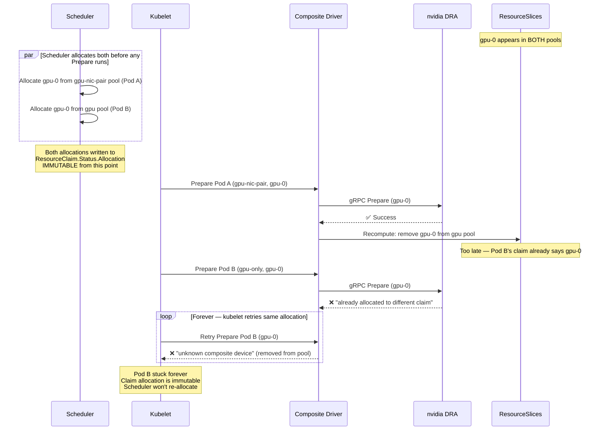

# RFC: Cross-Composition Device Exclusion

**Issue:** [#28](https://github.com/openshift-psap/composite-dra-driver/issues/28)
**Status:** Investigation complete, interim fix (Option A) implemented, long-term solution identified
**Date:** 2026-06-29

---

## Problem

When multiple compositions share an underlying source (e.g., GPU appears in both `gpu-nic-pair` and `gpu-only` compositions), each publishes the same physical device in separate ResourceSlice pools. The DRA scheduler sees these as unrelated devices and can allocate the same physical GPU from both pools simultaneously. The underlying driver (nvidia) rejects the second allocation:

```
requested device gpu-0 is already allocated to different claim
```

### Why This Happens

The DRA scheduler identifies devices by `DeviceID = (Driver, Pool, Device)`. When the same physical GPU appears in two pools with different device names, the scheduler has no way to know they share hardware:

```
DeviceID("composite.dra.io", "node1-gpu-nic-pair", "gpu-0--nic-0")  ← pool 1
DeviceID("composite.dra.io", "node1-gpu",          "gpu-0")          ← pool 2
```

These are independent DeviceIDs. `deviceInUse()` never connects them.

### The Fatal Race Window

Dynamic exclusion via ResourceSlice recomputation was attempted but has a fatal race:



**Verified on hardware:** Reproduced on janus (H200 cluster) and poseidon (H100 cluster). Both webhook path and direct ResourceClaimTemplate path exhibit the same behavior. The webhook is not involved in allocation — the scheduler is.

---

## Options Evaluated

### Option A: Static Partitioning (Interim Fix — Implemented)

Process compositions in priority order during `ComputePairs()`. Higher-priority compositions consume devices first; lower-priority only sees remaining devices. No overlap → no race.

```go
// ComputePairs processes compositions in priority order
sorted := sortByPriority(compositions)  // highest first
consumed := map[string]map[string]bool{}
for _, comp := range sorted {
    available := excludeConsumed(devicesBySource, consumed)
    pairs := computeForComposition(comp, available)
    markConsumed(consumed, pairs)
}
```

| Aspect | Assessment |
|--------|-----------|
| Correctness | Race-free by construction |
| Complexity | Low |
| DRA compliance | Full — standard ResourceSlice publishing |
| Downside | Lower-priority pools show reduced capacity at rest |
| K8s version | Any (1.34+) |

**Status:** Implemented in [PR #42](https://github.com/openshift-psap/composite-dra-driver/pull/42) with dynamic recomputation for capacity recovery. The dynamic recomputation works for the direction it was tested (higher-priority releasing devices back), but the static partition is the safety boundary that prevents the race.

### Option B: Prepare-side Deallocation

Clear `ResourceClaim.Status.Allocation` when Prepare detects a conflict, forcing scheduler to re-allocate.

| Aspect | Assessment |
|--------|-----------|
| Correctness | Fragile — allocation loops possible |
| Complexity | Medium |
| DRA compliance | **Very low** — drivers should not clear scheduler-owned status |
| Risk | Infinite retry loops, controller races |

**Decision:** Rejected. Violates DRA conventions. The scheduler owns allocation status.

### Option C: Hybrid Static + Dynamic

Static partitioning as baseline, with dynamic rebalancing when higher-priority releases devices.

| Aspect | Assessment |
|--------|-----------|
| Correctness | Race-free for static, residual race for dynamic rebalancing |
| Complexity | High |
| DRA compliance | Full |
| Downside | Rebalancing can reintroduce the race in reverse |

**Decision:** The dynamic part is implemented in PR #42 but only for capacity recovery (higher-priority → lower-priority direction). Full bidirectional rebalancing has residual race risk.

### Option D: Pre-Prepare Validation

Check device availability before creating shadow claims. Return error if consumed.

| Aspect | Assessment |
|--------|-----------|
| Correctness | **Insufficient** — claim allocation is immutable, scheduler won't re-allocate |
| Complexity | Low |
| DRA compliance | Full |
| Fatal flaw | Pod stuck forever (same as the race — kubelet retries same stale allocation) |

**Decision:** Rejected. Verified on hardware that Prepare errors don't trigger scheduler re-allocation.

---

## Long-Term Solution: SharedCounters (DRAPartitionableDevices)

### The Missing Primitive

The DRA API (K8s 1.33+) includes `SharedCounters` and `ConsumesCounters` fields, gated behind `DRAPartitionableDevices`:

```yaml
# ResourceSlice
pool: composite.dra.io-node1
sharedCounters:
  - name: physical-gpus
    counters:
      gpu-0: {value: "1"}
      gpu-1: {value: "1"}
      gpu-2: {value: "1"}
      # ... one counter per physical GPU

devices:
  - name: gpu-0                  # standalone GPU composition
    consumesCounters:
      - counterSet: physical-gpus
        counters: {gpu-0: {value: "1"}}   # consumes gpu-0 counter
    attributes:
      composite/compositionName: "gpu"

  - name: gpu-0--nic-0           # GPU-NIC pair composition
    consumesCounters:
      - counterSet: physical-gpus
        counters: {gpu-0: {value: "1"}}   # SAME counter as standalone
    attributes:
      composite/compositionName: "gpu-nic-pair"
```

When the scheduler allocates `gpu-0--nic-0`, it depletes counter `gpu-0`. When it tries to allocate standalone `gpu-0`, the counter is exhausted → scheduler skips it and picks `gpu-1`.

### How Counter-Based Exclusion Works in the Scheduler

From [allocator_stable.go](https://github.com/kubernetes/kubernetes/blob/master/staging/src/k8s.io/dynamic-resource-allocation/structured/internal/stable/allocator_stable.go) and [allocator_incubating.go](https://github.com/kubernetes/kubernetes/blob/master/staging/src/k8s.io/dynamic-resource-allocation/structured/internal/incubating/allocator_incubating.go):

1. `deviceInUse(DeviceID)` prevents same DeviceID from being allocated twice (standard path)
2. `AllowMultipleAllocations=true` bypasses `deviceInUse()` — multiple claims can share the same device
3. `checkAvailableCounters()` enforces capacity limits — when a counter is depleted, the device is skipped
4. `ConsumedCapacity` in `DeviceRequestAllocationResult` tracks how much each allocation consumed
5. `ShareID` differentiates concurrent shares of the same device

### Why This Solves Our Problem

- Both `gpu-0` (standalone) and `gpu-0--nic-0` (pair) declare they consume counter `gpu-0`
- The scheduler depletes the counter on first allocation
- Second allocation sees counter exhausted → picks a different GPU
- **No race** — counter check happens inside the scheduler's allocation loop, before writing to ResourceClaim.Status
- **Fully dynamic** — no static partitioning needed, all devices visible to all compositions
- **Scheduler-native** — mutual exclusion enforced by the scheduler, not by the driver

### Feature Gate Status

| K8s Version | `DRAPartitionableDevices` | `DRAConsumableCapacity` |
|-------------|--------------------------|------------------------|
| 1.33 | Alpha, disabled | — |
| 1.34 | Alpha, disabled | Alpha, disabled |
| 1.35 | Alpha (breaking API changes) | Alpha |
| **1.36** | **Beta, enabled by default** | **Beta, enabled by default** |

**On OpenShift 4.20 (K8s 1.34):** Enabling alpha feature gates requires `CustomNoUpgrade` FeatureGate, which triggers rolling node reboots and blocks future OCP upgrades. Not recommended for shared clusters.

**On OpenShift 4.22+ (K8s 1.36):** Both features are beta and enabled by default. No cluster configuration needed.

### Implementation Plan (for 1.36+)

1. **Restructure publisher**: single pool per node containing ALL compositions' devices
2. **Add SharedCounters**: one counter per physical device (GPU, NIC, etc.)
3. **Add ConsumesCounters to each device**: map composite device → underlying physical device counters
4. **Update DeviceClass selectors**: use `compositionName` attribute to distinguish compositions
5. **Remove multi-pool architecture**: no separate pools per composition
6. **Remove static partitioning**: no longer needed — scheduler handles exclusion

### API Constraints

- Max 8 counter sets per ResourceSlice (`ResourceSliceMaxCounterSets`)
- Max 32 counters per counter set (`ResourceSliceMaxCountersPerCounterSet`)
- Max 2 counter consumptions per device (`ResourceSliceMaxDeviceCounterConsumptionsPerDevice`)
- Max 64 devices per slice when using counters (vs 128 without)

For 8 GPUs + 8 NICs per node: 1 counter set with 8 GPU counters + 1 counter set with 8 NIC counters = 2 counter sets. Well within limits.

---

## References

### Kubernetes Source

- [allocator_stable.go](https://github.com/kubernetes/kubernetes/blob/master/staging/src/k8s.io/dynamic-resource-allocation/structured/internal/stable/allocator_stable.go) — `deviceInUse()`, `allocatingDevices` map, allocation exclusion logic
- [allocator_incubating.go](https://github.com/kubernetes/kubernetes/blob/master/staging/src/k8s.io/dynamic-resource-allocation/structured/internal/incubating/allocator_incubating.go) — `AllowMultipleAllocations`, `checkAvailableCounters()`, SharedCounters integration
- [allocateddevices.go](https://github.com/kubernetes/kubernetes/blob/master/pkg/scheduler/framework/plugins/dynamicresources/allocateddevices.go) — `allocatedDevices` cache, event handlers
- [k8s.io/api/resource/v1/types.go](https://github.com/kubernetes/kubernetes/blob/master/staging/src/k8s.io/api/resource/v1/types.go) — `Device.AllowMultipleAllocations`, `Device.ConsumesCounters`, `CounterSet`, `SharedCounters`

### KEPs

- [KEP-4381: DRA Structured Parameters](https://github.com/kubernetes/enhancements/blob/master/keps/sig-node/4381-dra-structured-parameters/README.md) — base DRA architecture
- [KEP-5075: DRA Consumable Capacity](https://github.com/kubernetes/enhancements/blob/master/keps/sig-scheduling/5075-dra-consumable-capacity/README.md) — `AllowMultipleAllocations`, capacity-based sharing

### Upstream Discussions

- [wg-device-management #54](https://github.com/kubernetes-sigs/wg-device-management/issues/54) — cross-pool mutual exclusion discussion
- [kubernetes #136567](https://github.com/kubernetes/kubernetes/pull/136567) — fix for same device allocated twice (confirms single-allocation is intended default)
- [kubernetes #137617](https://github.com/kubernetes/kubernetes/issues/137617) — gang scheduling + shared claims deadlock bug

### Related Issues

- [#28](https://github.com/openshift-psap/composite-dra-driver/issues/28) — Device sharing conflict (this problem)
- [#41](https://github.com/openshift-psap/composite-dra-driver/issues/41) — Investigate encapsulating underlying DRA drivers
- [#43](https://github.com/openshift-psap/composite-dra-driver/issues/43) — Synthesis performance scaling
- [#45](https://github.com/openshift-psap/composite-dra-driver/issues/45) — Deployment experience improvements

### wg-device-management Meeting

- 2026-06-23 meeting: @johnbelamaric suggested the composite driver could become the sole contact surface for underlying drivers. Recording/transcript pending.
